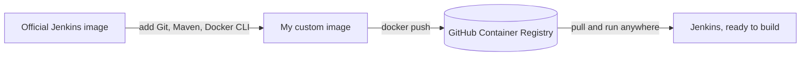

# Jenkins Docker CI/CD Image

A Jenkins image with Git, Maven, and the Docker CLI already baked in, so you don't have to install them by hand every time you spin up a new container.

## Why I built this

I kept running into the same problem. Every time I started a fresh Jenkins container, whether on a new machine or after rebuilding one, I had to install the same things before any pipeline would actually work:

- Docker CLI, so Jenkins can build and push images
- Git, so it can clone repos
- Maven, so it can build Java projects

Instead of setting these up after the container starts, I put them straight into the image itself. Now a new Jenkins container comes up already able to build and push, no setup required.



## What's in the image

- Jenkins LTS (comes with Java 21)
- Git
- Maven
- Docker CLI
- A few small dependencies needed to add Docker's package repo: curl, wget, unzip, gnupg, ca-certificates

## The Dockerfile Explained


### FROM jenkins/jenkins:lts-jdk21:
- Uses the official Jenkins LTS image as the base layer. This image already ships with Jenkins itself and a Java 21 runtime, so those don't need to be provisioned separately.

### USER root:
- Switches to the root user inside the container. Package installation via apt-get requires elevated privileges, so this is necessary before the following RUN instructions.

 ### FIRST RUN apt-get update && apt-get install -y...:
This instruction installs the core tools your pipelines actually need plus a few supporting utilities. Apt-get update refreshes the package index first, then apt-get install -y pulls in everything listed. Git and Maven are there for direct pipeline use (cloning repos, building Java projects); curl, wget, and unzip are general-purpose utilities for downloading and extracting files; and gnupg and ca-certificates aren't used on their own here — they exist to make the next RUN instruction work, since that step needs to verify a signing key and connect over HTTPS.
The rm -rf /var/lib/apt/lists/* at the end just deletes the package index cache after installation finishes. It doesn't remove anything you installed — it's purely cleanup to keep the image size down.

### RUN curl -fsSL https://download.docker.com/linux/debian/gpg | gpg --dearmor -o /usr/share/keyrings/docker.gpg && \....:
This instruction installs the Docker CLI. It fetches Docker's signing key, registers Docker's official APT repository, refreshes the package index so APT sees the new repository, and finally installs docker-ce-cli — the Docker command-line client only, not the full Docker engine.

USER jenkins


## How I built and pushed it

```bash
docker build -t my-jenkins .
docker tag my-jenkins ada045/my-jenkins:1.1
docker push ada045/my-jenkins:1.1.
```

## Running it

```bash
docker run -d \
  --name jenkins \
  -p 8080:8080 \
  -p 50000:50000 \
  -v /var/run/docker.sock:/var/run/docker.sock \
  -v jenkins_home:/var/jenkins_home
  ada045/my-jenkins:1.1
```

The socket mount is the important part here. It's what lets Jenkins run `docker build` and `docker push` using the host's Docker engine, instead of needing a Docker daemon running inside the container.

Once it's up, go to `http://localhost:8080` and finish the Jenkins setup screen.

## Using it on a new server

This is the whole reason I made it. On any machine with Docker installed:

```bash
docker pull ghcr.io/your-username/my-jenkins:latest
docker run -d -p 8080:8080 -v /var/run/docker.sock:/var/run/docker.sock ghcr.io/your-username/my-jenkins:latest
```

Git, Maven, and the Docker CLI are already there. Nothing else to install.

## Example pipeline

A pipeline running on this image can jump straight into building, since nothing needs to be installed first:

```groovy
pipeline {
    agent any
    stages {
        stage('Checkout') {
            steps {
                git branch: 'main', url: 'https://github.com/your-username/your-app.git'
            }
        }
        stage('Build with Maven') {
            steps {
                sh 'mvn clean package -DskipTests'
            }
        }
        stage('Build Docker Image') {
            steps {
                sh 'docker build -t my-app:latest .'
            }
        }
    }
}
```

## Screenshots

_Add a screenshot of the Jenkins dashboard and a pipeline run here._

## What I learned

Baking the tools into the image once was way less work than I expected, and it's saved me from repeating the same setup on every machine since.

The Docker CLI alone is enough. I didn't need to run a full Docker daemon inside the container. Mounting the host's socket handles everything.

The Dockerfile itself ended up being a better reference for "what's installed here" than any notes I could've kept. If someone asks what's in the Jenkins environment, the answer is just: read the file.

## What I'd add next

- Automate the build and push with GitHub Actions
- Use real version tags instead of just `latest`
- Maybe add optional support for other languages, like Node.js or Python

## License

MIT — see [LICENSE](./LICENSE).
