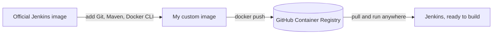

# Jenkins Docker CI/CD Image

A Jenkins image with Git, Maven, and the Docker CLI already baked in, so you don't have to install them by hand every time you spin up a new container.

## Why I built this

I kept running into the same problem. Every time I started a fresh Jenkins container, whether on a new machine or after rebuilding one, I had to install the same things before any pipeline would actually work:

- Docker CLI, so Jenkins can build and push images
- Git, so it can clone repos
- Maven, so it can build Java projects

Instead of setting these up after the container starts, I put them straight into the image itself. Now a new Jenkins container comes up already able to build and push, no setup required.




## What's in the image

- Jenkins LTS (comes with Java 21)
- Git
- Maven
- Docker CLI
- A few small dependencies needed to add Docker's package repo: curl, wget, unzip, gnupg, ca-certificates

## The Dockerfile Explained


### FROM jenkins/jenkins:lts-jdk21:
- Uses the official Jenkins LTS image as the base layer. This image already ships with Jenkins itself and a Java 21 runtime, so those don't need to be provisioned separately.

### USER root:
- Switches to the root user inside the container. Package installation via apt-get requires elevated privileges, so this is necessary before the following RUN instructions.

 ### FIRST RUN apt-get update && apt-get install -y...:
This instruction installs the core tools your pipelines actually need plus a few supporting utilities. Apt-get update refreshes the package index first, then apt-get install -y pulls in everything listed. Git and Maven are there for direct pipeline use (cloning repos, building Java projects); curl, wget, and unzip are general-purpose utilities for downloading and extracting files; and gnupg and ca-certificates aren't used on their own here — they exist to make the next RUN instruction work, since that step needs to verify a signing key and connect over HTTPS.
The rm -rf /var/lib/apt/lists/* at the end just deletes the package index cache after installation finishes. It doesn't remove anything you installed — it's purely cleanup to keep the image size down.

### RUN curl -fsSL https://download.docker.com/linux/debian/gpg | gpg --dearmor -o /usr/share/keyrings/docker.gpg && \....:
This instruction installs the Docker CLI. It fetches Docker's signing key, registers Docker's official APT repository, refreshes the package index so APT sees the new repository, and finally installs docker-ce-cli — the Docker command-line client only, not the full Docker engine.

## How I built and pushed it

```bash
docker build -t my-jenkins .
docker tag my-jenkins ada045/my-jenkins:1.1
docker push ada045/my-jenkins:1.1.
```

## Running it

```bash
docker run -d \
  --name jenkins \
  -p 8080:8080 \
  -p 50000:50000 \
  -v /var/run/docker.sock:/var/run/docker.sock \
  -v jenkins_home:/var/jenkins_home
  ada045/my-jenkins:1.1
```
- -d — runs the container in detached mode, so it runs in the background instead of tying up the terminal.
- --name jenkins — gives the container a name I can reference later instead of Docker generating a random one.
- -p 8080:8080 — maps port 8080 on my host to port 8080 in the container, which is where Jenkins's web UI runs.
- -p 50000:50000 — maps the port Jenkins uses for agent communication, in case external build agents ever connect to this controller.
- -v jenkins_home:/var/jenkins_home — mounts my existing Jenkins data volume for persistence. I had a previous Jenkins container with plugins and configuration already set up, so mounting the same volume here means none of that is lost — this container comes up exactly as I left it.
- -v /var/run/docker.sock:/var/run/docker.sock — mounts the host's Docker socket into the container. This is the communication channel between the Docker CLI inside the container and the Docker daemon on the host, so any docker command run inside the container is actually carried out by the host's daemon.
- ada045/my-jenkins:1.1 - This is my image name.
- 


## What I learned

- Baking the tools into the image once was way less work than I expected, and it's saved me from repeating the same setup on every machine since.
- I assumed that adding the /var/run/docker.sock volume meant Docker was basically installed in my container already. It wasn't until my commands weren't working that I realized the socket alone doesn't do anything — I actually needed the Docker CLI installed too, because without it there's nothing inside the container to even run the docker command in the first place. The socket just gives it somewhere to send that command to.
- I had an old Jenkins container with plugins and jobs already configured, and I didn't want to lose all that just because I was rebuilding the image. Mounting the same volume into the new container saved me from starting from start again.
