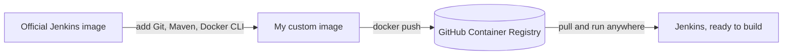

# Jenkins Docker CI/CD Image

A Jenkins image with Git, Maven, and the Docker CLI already baked in, so you don't have to install them by hand every time you spin up a new container.

## Why I built this

I kept running into the same problem. Every time I started a fresh Jenkins container, whether on a new machine or after rebuilding one, I had to install the same things before any pipeline would actually work:

- Docker CLI, so Jenkins can build and push images
- Git, so it can clone repos
- Maven, so it can build Java projects

Instead of setting these up after the container starts, I put them straight into the image itself. Now a new Jenkins container comes up already able to build and push, no setup required.



## What's in the image

- Jenkins LTS (comes with Java 21)
- Git
- Maven
- Docker CLI
- A few small dependencies needed to add Docker's package repo: curl, wget, unzip, gnupg, ca-certificates

## The Dockerfile

```dockerfile
FROM jenkins/jenkins:lts-jdk21

USER root

RUN apt-get update && apt-get install -y \
    git \
    curl \
    wget \
    unzip \
    maven \
    gnupg \
    ca-certificates \
    && rm -rf /var/lib/apt/lists/*

RUN curl -fsSL https://download.docker.com/linux/debian/gpg | gpg --dearmor -o /usr/share/keyrings/docker.gpg && \
    echo "deb [arch=$(dpkg --print-architecture) signed-by=/usr/share/keyrings/docker.gpg] https://download.docker.com/linux/debian bookworm stable" > /etc/apt/sources.list.d/docker.list && \
    apt-get update && \
    apt-get install -y docker-ce-cli

USER jenkins
```

Walking through it:

Starting point is the official Jenkins LTS image, which already ships with Java 21, so that's covered from the start.

The first `RUN` installs Git and Maven directly, plus a handful of smaller tools (curl, wget, unzip, gnupg, ca-certificates) that aren't needed on their own but are required for the next step to work.

The second `RUN` adds Docker's official APT repository and installs the Docker CLI. Just the CLI, not the full Docker engine. Jenkins doesn't run its own Docker daemon inside the container; it talks to the one already running on the host machine.

Last line switches back to the jenkins user, so the container isn't running as root once it's up.

## How I built and pushed it

```bash
docker build -t my-jenkins .
docker tag my-jenkins ghcr.io/your-username/my-jenkins:latest
docker push ghcr.io/your-username/my-jenkins:latest
```

Build it, tag it for the registry, push it. That's really all there is to it.

## Running it

```bash
docker run -d \
  --name jenkins \
  -p 8080:8080 \
  -v /var/run/docker.sock:/var/run/docker.sock \
  ghcr.io/your-username/my-jenkins:latest
```

The socket mount is the important part here. It's what lets Jenkins run `docker build` and `docker push` using the host's Docker engine, instead of needing a Docker daemon running inside the container.

Once it's up, go to `http://localhost:8080` and finish the Jenkins setup screen.

## Using it on a new server

This is the whole reason I made it. On any machine with Docker installed:

```bash
docker pull ghcr.io/your-username/my-jenkins:latest
docker run -d -p 8080:8080 -v /var/run/docker.sock:/var/run/docker.sock ghcr.io/your-username/my-jenkins:latest
```

Git, Maven, and the Docker CLI are already there. Nothing else to install.

## Example pipeline

A pipeline running on this image can jump straight into building, since nothing needs to be installed first:

```groovy
pipeline {
    agent any
    stages {
        stage('Checkout') {
            steps {
                git branch: 'main', url: 'https://github.com/your-username/your-app.git'
            }
        }
        stage('Build with Maven') {
            steps {
                sh 'mvn clean package -DskipTests'
            }
        }
        stage('Build Docker Image') {
            steps {
                sh 'docker build -t my-app:latest .'
            }
        }
    }
}
```

## Screenshots

_Add a screenshot of the Jenkins dashboard and a pipeline run here._

## What I learned

Baking the tools into the image once was way less work than I expected, and it's saved me from repeating the same setup on every machine since.

The Docker CLI alone is enough. I didn't need to run a full Docker daemon inside the container. Mounting the host's socket handles everything.

The Dockerfile itself ended up being a better reference for "what's installed here" than any notes I could've kept. If someone asks what's in the Jenkins environment, the answer is just: read the file.

## What I'd add next

- Automate the build and push with GitHub Actions
- Use real version tags instead of just `latest`
- Maybe add optional support for other languages, like Node.js or Python

## License

MIT — see [LICENSE](./LICENSE).
